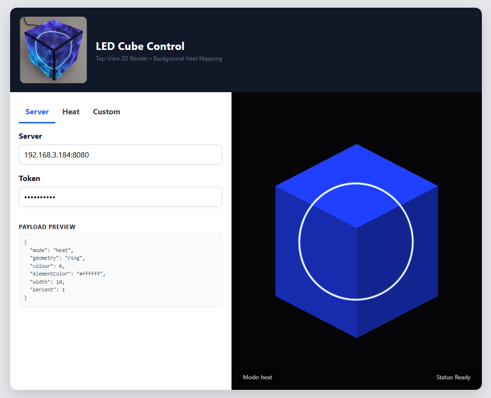
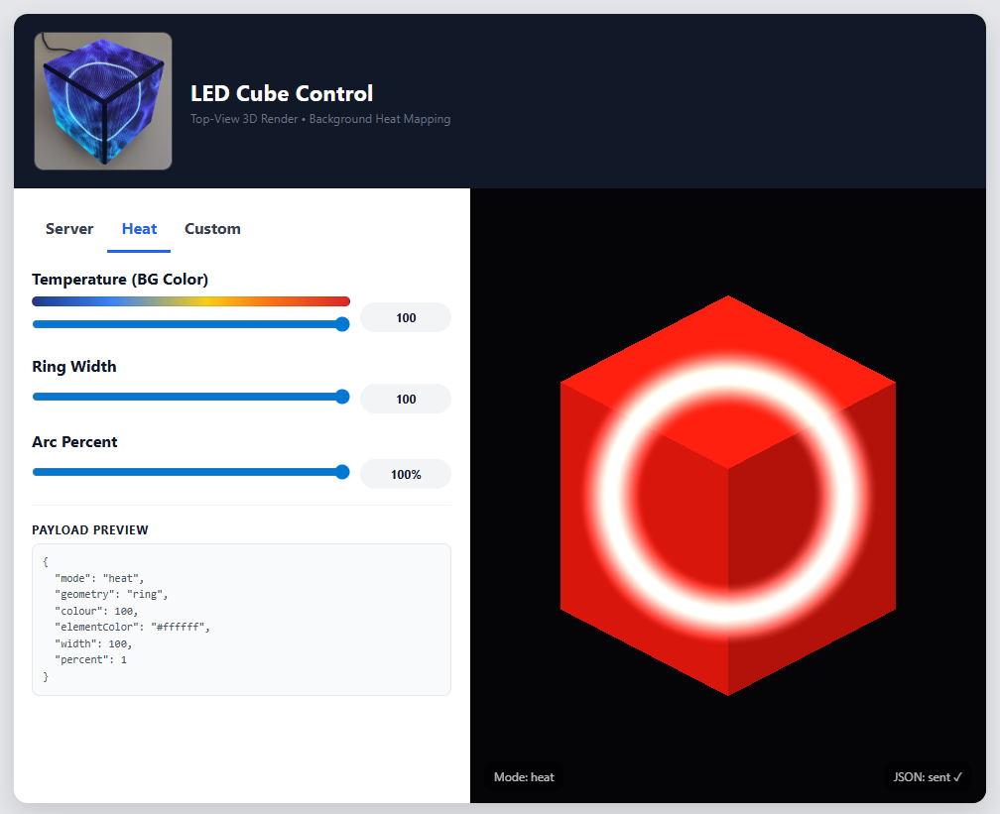
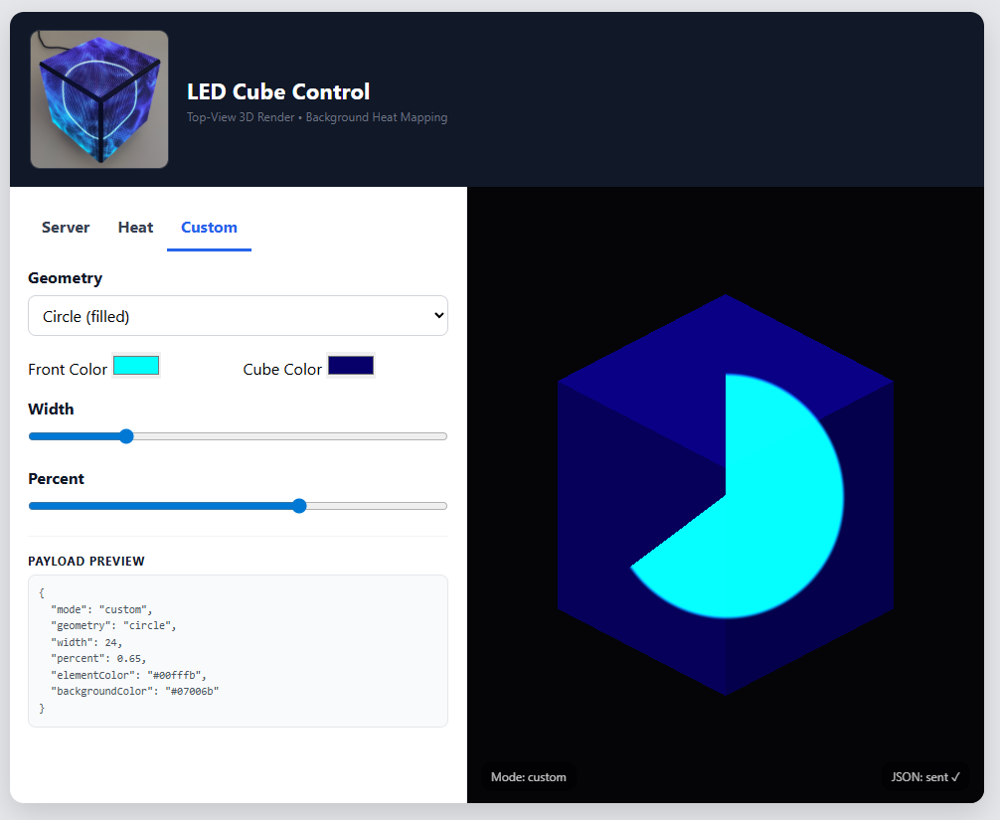
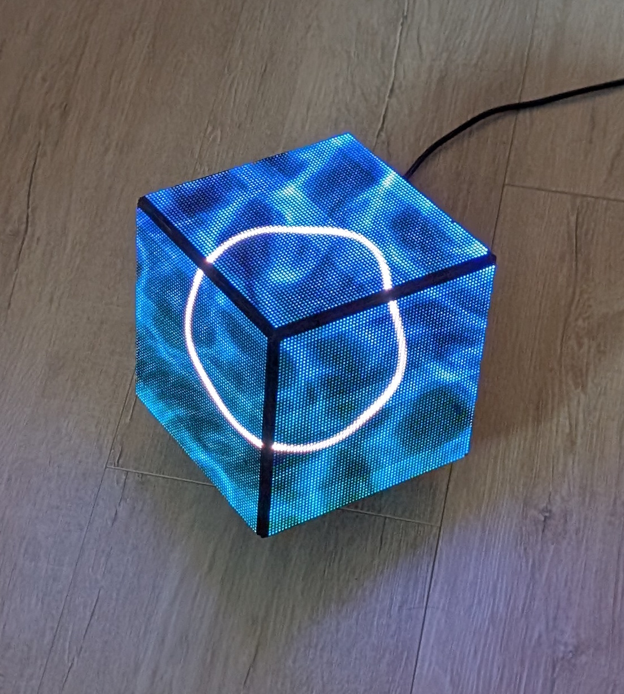
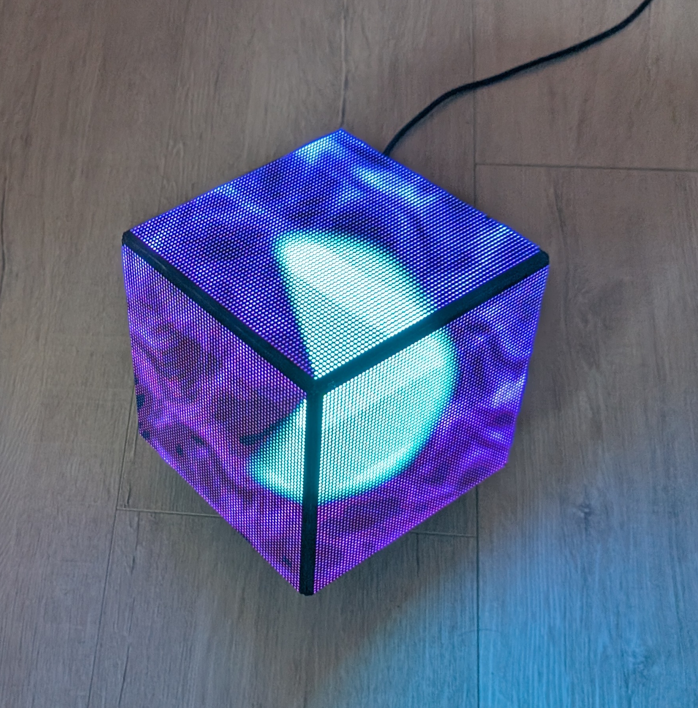
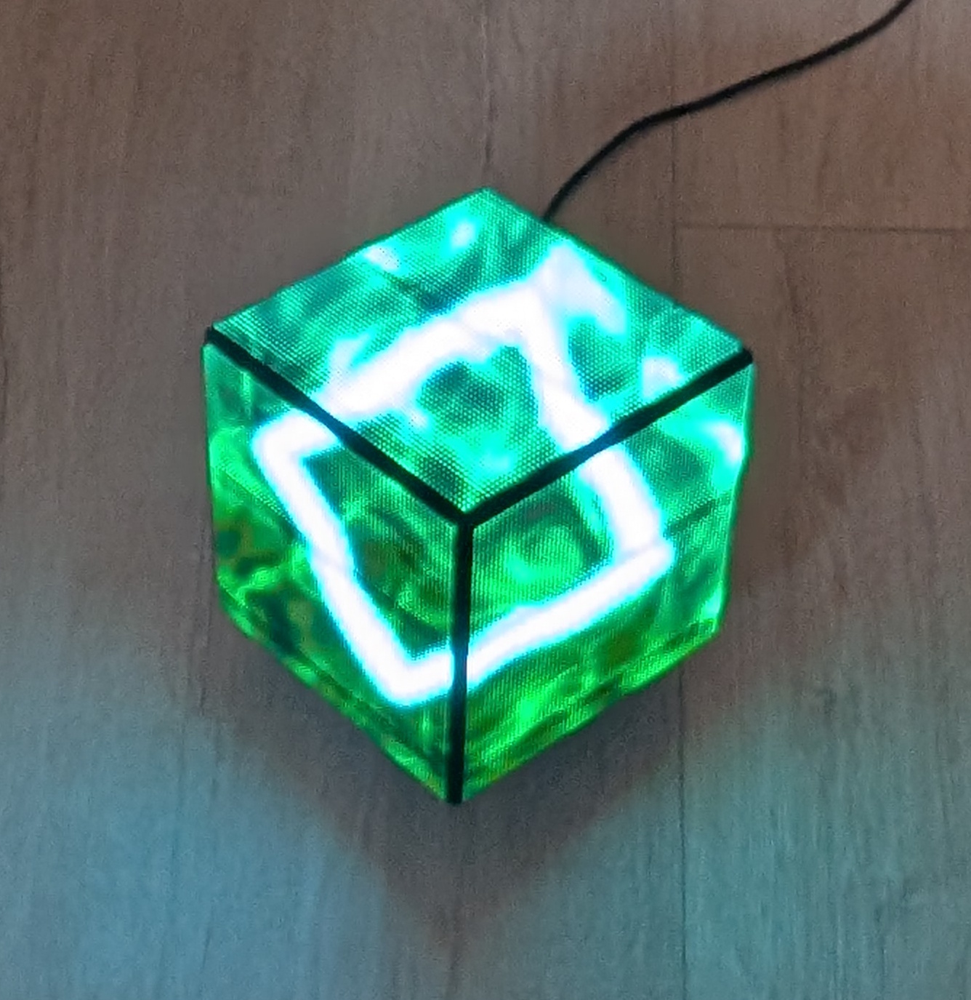
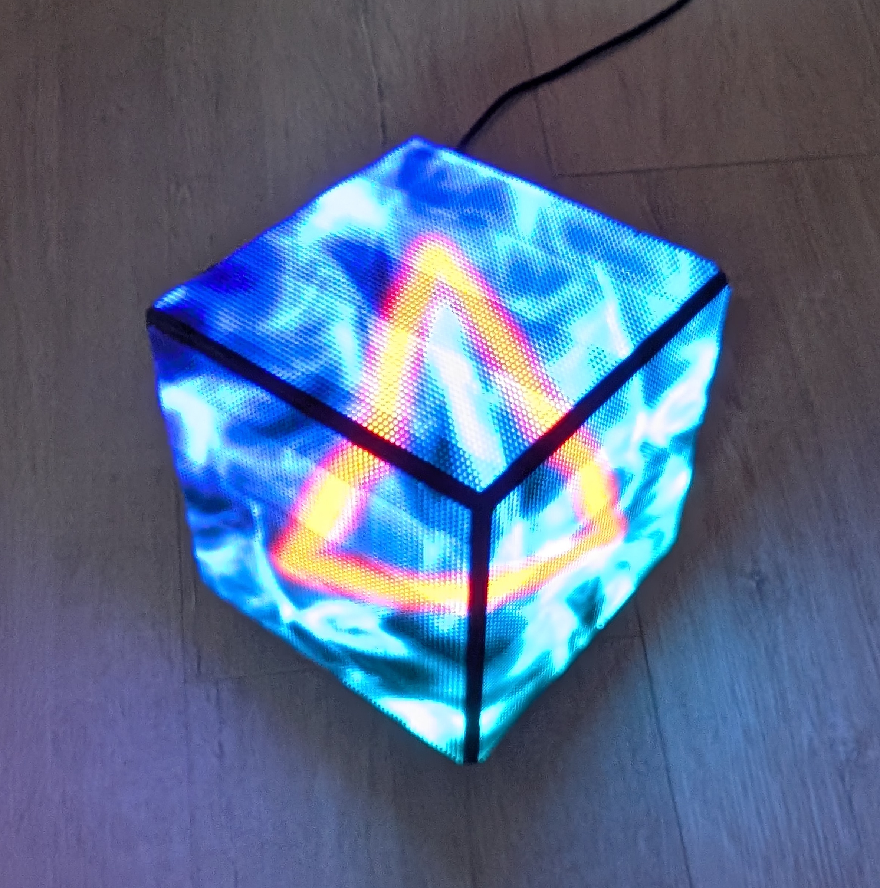

<p align="center">
  
</p>

# LED Cube Controller: REST API & GLES2 Shader Overhaul

This project is a heavily modernized version of the [there.oughta.be](https://there.oughta.be/an/led-cube) cube. It has been transformed from a basic CPU monitor into a real-time, API-controllable art piece featuring custom GLES2 shaders and a smooth "Magic Shine" procedural background.

## Key Features
* **Modern REST API:** Replaced legacy scripts with a multi-threaded C++ API (`cpp-httplib`) allowing real-time JSON control.
* **Magic Shine Shaders:** A procedural background that isn't just a flat color; it features spatial color shifting (Teal/Blue transitions) and organic "plasma" movement.
* **Variable Geometry:** Supports Rings, Squares, Triangles, and X-shapes with dynamic thickness (`width`) and arc completion (`percent`).
* **Smooth Tapering:** Transitions between the "active" fat part of a shape and the "stable" thin base line (2px wide) are smoothly feathered.
* **Hardware Optimized:** Specifically tuned for Raspberry Pi 2 GPIO timings and FM6126A LED panels.

---

## Hardware & Dependencies

### 1. Panel Configuration
* **Resolution:** 3 panels (64x64 each) for a total width of 192.
* **Alignment:** `map_flip_x = false`, `map_flip_y = false`, and `map_reverse_panels = false`.

## WLAN Driver Installation (Archer T2U Nano)

The TP-Link Archer T2U Nano uses the **Realtek RTL8811AU** chipset (ID 2357:011e). Because your kernel is `5.15.84-v7+`, you must manually install the headers and build the driver using the following exact commands.

### 1. Installation & Driver Build Commands

```bash
# 1. Update the package lists
sudo apt update

# 2. Install the kernel headers and build tools (Required for .h files)
sudo apt install raspberrypi-kernel-headers build-essential bc dkms git -y

# 3. Navigate into your driver source directory
cd ~/8821au-20210708

# 4. Clean any previous failed build attempts
make clean

# 5. Set the environment flag to bypass the GCC version mismatch (8 vs 10)
export IGNORE_CC_MISMATCH=1

# 6. Execute the automated installer script
sudo ./install-driver.sh
```

### 2. Post-Installation & Network Config

Once the installer finishes, it will prompt for a reboot. After the reboot, execute these commands to finalize the connection:

```bash
# 1. Verify that the wlan0 interface is now active
ip link show wlan0

# 2. Open the configuration utility to set your SSID and Password
sudo raspi-config
# Use arrow keys: 1 System Options -> S1 Wireless LAN
```

### Audio Hardware Conflict (PWM)
The LED matrix library conflicts with the Pi's onboard sound module.

**Symptoms:**
* Error: `snd_bcm2835: found that the Pi sound module is loaded.`
* Matrix flickers or refuses to start.

**Fix:**
```bash
# Disable audio in config
sudo sed -i 's/dtparam=audio=on/dtparam=audio=off/g' /boot/config.txt
# Blacklist the module
echo "blacklist snd_bcm2835" | sudo tee /etc/modprobe.d/alsa-blacklist.conf
sudo reboot
```

---

## Project Headers & Dependencies

The C++ controller requires specific header files to be present in the project directory (`~/stats-gl/`) for successful compilation:

* **`httplib.h`**: Manages the multi-threaded REST API server.
* **`json.hpp`**: Handles the parsing of JSON payloads for the `/update` endpoint.
* **`GL/gl.h` & `EGL/egl.h`**: Provided by the Raspberry Pi Userland for OpenGL ES 2.0 rendering.
* **`rpi-rgb-led-matrix`**: The core library headers for the 192x64 panel array.

---

## Orientation Fixes
To ensure animations (like the circular `percent` arc) flow correctly across the Top, Left, and Right faces, the `map_xy` function handles local panel inversions.
* **Top Panel (0-63):** The X-axis is locally flipped (`63 - mx`) inside the `map_xy` logic. This ensures that as the `percent` increases, the arc flows seamlessly across physical edges rather than jumping or reversing.
* **Left/Right Panels:** Standard alignment.

**Rotation Schema for vcoords (8 rows):**
If you need to physically rotate panels, use this schema for the coordinate transformation:
1. `1 2 3 4 5 6 7 8` (Original)
2. `5 6 1 2 7 8 3 4` (90° CW)
3. `7 8 5 6 3 4 1 2` (180°)
4. `3 4 7 8 1 2 5 6` (270°)

---

## API Documentation
**Base URL:** `http://<pi-ip>:8080`  
**Auth:** Header `X-API-Token: 1234567890`

### 1. POST /update
Updates the visual state. Supports both legacy "heat" payloads and new "custom" modes.

**Payload Example:**
{
  "mode": "heat",
  "geometry": "ring",
  "colour": 15,
  "elementColor": "#ffffff",
  "width": 47,
  "percent": 0.74
}

| Field | Range | Description |
| :--- | :--- | :--- |
| `mode` | "heat" / "custom" | "heat" uses auto-gradients; "custom" uses your specific hex colors. |
| `geometry` | "ring", "circle", "square", "triangle", "x" | Sets the active shape. |
| `width` | 0 - 100 | The thickness of the "fat" segment (Active part). |
| `percent` | 0.0 - 1.0 | How much of the shape is "filled" with the active width. |
| `elementColor` | Hex String | The color of the geometry itself (rendered purely in front). |
| `backgroundColor`| Hex String | Tints the "Magic Shine" procedural background. |

### 2. GET /status
Returns current interpolated live values, signal age, and blanking status.

### 3) GET /health
**Purpose:** Lightweight liveness probe to verify the service is healthy.
**Response (JSON):**
```json
{
  "ok": true, 
  "uptime": 123456
}
```

* **ok**: Always `true` if the server is responding.
* **uptime**: Total seconds the C++ process has been active.

---

### 4) GET /config
**Purpose:** Returns the static hardware and software limits defined at compile-time.
**Response (JSON):**
```json
{
  "width": 192,
  "height": 64,
  "targetFps": 40,
  "blankInterval": 60,
  "animStep": 40.0
}
```

* **width/height**: The total resolution of the 3-panel array (192x64).
* **targetFps**: The internal frame-pacing goal for the Pi 2.
* **blankInterval**: Seconds of inactivity before the signal-loss (grayscale) logic triggers.


---

## Shader Logic
* **Double Base Line:** The shape never fully disappears. A stable "thin" version (approx. 2px wide) remains visible even where the `percent` hasn't reached.
* **Seamless 100%:** At `percent: 1.0`, the shader bypasses the start/end ramps to ensure the shape is perfectly continuous without a gap at the 12 o'clock join.
* **Stable Base:** The "wobble" (audio/segment movement) is only applied to the fat part (`activeWobble = segmentf * pmask`). This keeps the thin base line perfectly still for a high-quality look.
* **Signal Loss Fade:** If no API data is received for a set time, the **background only** fades to grayscale (Signal-loss logic), while the foreground element remains in pure color.

---

## Installation & Compilation

### OS Setup (Raspbian 11 Bullseye)
Install the Raspberry Pi Userland to provide the necessary OpenGL ES binaries:
```bash
git clone [https://github.com/raspberrypi/userland.git](https://github.com/raspberrypi/userland.git)
cd userland
sudo ./buildme
```

---

### Compilation

Ensure you link against the matrix and GL libraries. Use the following command to build the controller:

```bash
g++ -g -o led-controller main.cpp -std=c++11 \
-I/opt/vc/include -L/opt/vc/lib \
-Lrpi-rgb-led-matrix/lib -lrgbmatrix \
-lbrcmEGL -lbrcmGLESv2 -lrt -lm -lpthread -lstdc++
```


### Autostart Configuration (Systemd)

To ensure the LED Cube Controller starts automatically on boot and stays running in the background, a `systemd` service is used.

#### 1. Create the Service File
Execute the following command to create the configuration file:
```bash
sudo nano /etc/systemd/system/led-cube.service
```

#### 2. Service Definition
Paste the following content into the editor (Adjust paths if your username differs):
```ini
[Unit]
Description=LED Cube Controller API
After=network.target

[Service]
Type=simple
User=mbeckerle
WorkingDirectory=/home/mbeckerle/stats-gl
ExecStart=/bin/bash /home/mbeckerle/stats-gl/run-led_cube.sh
Restart=always
RestartSec=5

[Install]
WantedBy=multi-user.target
```

#### 3. Activation Commands
Run these commands to enable and start the service:
```bash
# Reload systemd to recognize the new file
sudo systemctl daemon-reload

# Enable the service to run on every boot
sudo systemctl enable led-cube.service

# Start the service immediately
sudo systemctl start led-cube.service
```


---

## Password Reset Tip

If you are locked out of your Raspberry Pi (as I was, after several years, when I came back to my cube), use this generic recovery method:

1.  **Mount the SD card** on another computer.
2.  **Edit `cmdline.txt`**: Add `init=/bin/sh` to the end of the single line of text.
3.  **Boot the Pi**: At the shell prompt, run `mount -o remount,rw /`.
4.  **Reset Password**: Type `passwd <user>` (e.g., `pi`) and enter your new password.
5.  **Cleanup**: Run `sync`, power off, and **remove** the `init=/bin/sh` string from `cmdline.txt` before booting normally.


## UI Screenshots
### Initialization

<p align="center">
  
</p>

<p align="center">
  <em>Initialization & server connection</em>
</p>
### Heat Mode

<p align="center">
  
</p>

<p align="center">
  <em>Temperature-driven background with segmented ring</em>
</p>
### Custom Mode

<p align="center">
  
</p>

<p align="center">
  
</p>

<p align="center">
  <em>Custom geometry selection, colors and segment control</em>
</p>

## LED Cube Hardware

<p align="center">
  
</p>

<p align="center">
  
</p>

<p align="center">
  
</p>

<p align="center">
  
</p>

<p align="center">
  <em>192×64 RGB LED cube driven by Raspberry Pi 2</em>
</p>


## Credits

Originally based on the LED-Cube project by **Sebastian Staacks**. Modernized with high-performance GLES2 shaders, multi-panel coordinate mapping, and a multi-threaded C++ REST API.

For the original project inspiration and hardware build details, please refer to [there.oughta.be](https://there.oughta.be/an/led-cube).
